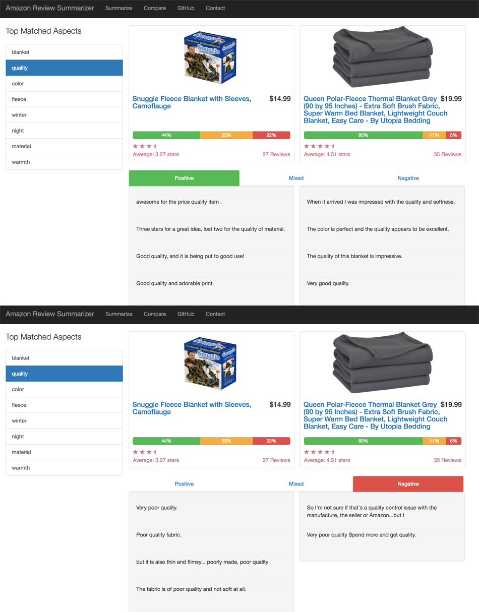

# Amazon Review Summarizer

Try out the application [here](http://52.22.222.234/)

## Background

Amazon has one of the largest corpus or reviews out there on the internet, but there is no feature that highlights how frequently word terms appear in the reviews for a product. This is implemented in other sites like yelp, glassdoor, and tripadvisor. Review highlights provide a simple way for consumers to get a snapshot of what people review about without sifting through a ton of reviews. Example of review highlights in yelp:


The goal of Amazon Review Summarizer is to build a web application that can execute the following tasks for any product on amazon:
* Extract common aspects from a corpus of reviews
* Perform opinion mining (positive and negative polarity) on top aspects

Amazon Review Summarizer also includes a tool for side-by-side product comparison. Given any two related products, a consumer will be able to compare the sentiments for any top aspect common to both products. Here is an example of this tool in action:



## Methodology

The main pipeline for Amazon Review Summarizer is composed of 6 steps:

1. Scrape the 300 most helpful Amazon reviews for the input product url(s).
2. Perform dependency parsing and part of speech tagging on every sentence in every scraped review.
3. Collect all nouns used in the reviews as candidate unigram aspects. Filter out unigrams that are unlikely to be aspects.
4. Perform association rule mining to find candidate bigram and trigram aspects. Use set of words obtained from Step #3 and compactness pruning to filter out bigrams that are unlikely to be aspects. Connect set of bigram words that appear frequently together in same sentences into trigrams.
5. Perform sentiment analysis and label reviews as either positive sentiment, negative sentiment, or mixed sentiment (unable to predict the sentiment polarity).
6. Display sentiment analysis results for the top 10 frequent aspects.

### Aspect Mining

### Sentiment Analysis

### Product Comparison

### Evaluation

## How to Run The Code

### Package Dependencies
* [Anaconda](https://docs.continuum.io/anaconda/install)
* afinn ```pip install afinn```
* celery ```pip install celery```
* [redis](https://www.digitalocean.com/community/tutorials/how-to-install-and-use-redis)
* [spacy](https://spacy.io/docs/#getting-started)
* textblob ```pip install textblob```

### Execution
1. Install required packages
2. Start redis with the following command: ```redis-server```
3. Start celery with the following command from the app folder: ```celery -A app.celery worker```
4. Start flask app with the following command from the app folder: ```python app.py```


## References
* [amadown2py](https://github.com/aesuli/amadown2py)
* Hu & Liu's [Mining and Summarizing Customer Reviews](http://users.cis.fiu.edu/~lli003/Sum/KDD/2004/p168-hu.pdf) (2004)
* Hu & Liu's [Mining and Summarizing Customer Reviews](https://www.aaai.org/Papers/AAAI/2004/AAAI04-119.pdf) (2004)
* Bing Liu's [Sentiment Analysis and Opinion Mining](http://www.cs.uic.edu/~liub/FBS/SentimentAnalysis-and-OpinionMining.pdf) (2012)
